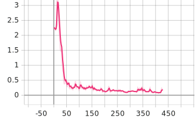

# Technical Report of Model Quantization Simulations on Convolution Neural Network based on AIMET and PyTorch

Zhang Di

University of Science and Technology of China

MIT HANLab (Internship)

trotsky@mail.ustc.edu.cn

## Abstraction

In this technical report, after investigating the selected 3 models and 3 datasets, we trained the models on the datasets with some tricks and recorded the corresponding loss functions and accuracy curves both training and validating. Then we apply the cross-layer equalization and bias correction techniques to these models. Finally we perform quantization aware training on this models with using AIMET QuantSim. After exporting finetuned model to the formats of ONNX and Qualcomm's DLC, we tried to inferencing these model with Snapdragon Neural Processing SDK with the corresponding quantization parameters.

## Introduction

To boost the inferencing speed of ML models on mobile devices or embedded devices, we can use quantizing tools or runtime APIs to convert the origin floating-point parameters of the model into fixed-point parameters. This trick can reduce the overhead of computation of model’s inference, but it always leads to a loss in model’s accuracy since quantization procedure can introduce noises because of conversion error between deferent numerical formats. So AIMET introduced a serials of APIs which can apply a simulated quantization effects to models, and then user can fine-tune their model to reduce these effects and recover loss of accuracy. Then model would get a better test performance after quantization than models quantized directly by runtime on the target devices.

## Installation and Envoirment configuring

At the begining, we should deploy AIMET on Ubuntu 20.04 LTS with a python3.7 or python3.6 envoirment.
For convenient, We installed a new and pure Python envoirment, it also can be done with Pyenv or venv from Anaconda.

```bash
sudo add-apt-repository ppa:deadsnakes/ppa
sudo apt-get update
sudo apt-get install python3.7
wget https://bootstrap.pypa.io/get-pip.py
python3.7 get-pip.py
pip3.7 install numpy
pip3.7 install torch==1.9.1+cu111 torchvision==0.10.1+cu111 torchaudio==0.9.1 -f https://download.pytorch.org/whl/torch_stable.html
pip3.7 install jupyter
```

Then we download the newest wheel files from Qualcomm's AIMET [release page](https://github.com/quic/aimet/releases/tag/1.17.0.py37). And configuring AIMET follow the introduction from [documents](https://github.com/quic/aimet/blob/develop/packaging/install.md).

After that, We can validate our installation by this script.

```python
import torch
from torchvision import models
from aimet_torch.quantsim import QuantizationSimModel
m = models.resnet18().cuda()
sim = QuantizationSimModel(m, dummy_input=torch.rand(1, 3, 224, 224).cuda())
print(sim)
```

If there doesn’t print Error informations, then the installation is completed.

## Choosing of models And datasets

Because of the restriction of device, we choosed 3 classical CNN models with pretrained weights for this experiment.

- ResNet18
- ShuffleNet V2 x1.0
- MobileNet V2

The first model, Resnet18 was widely used in computer visions and the last two models was famous for the usage in mobile deployment as the lightweight model.

| Name               | Params | Estimated Size |
| ------------------ | ------ | -------------- |
| ShuffleNet V2 x1.0 | 352K   | 1.558MB        |
| ResNet18           | 11.2M  | 44.727MB       |
| MobileNet V2       | 2.2M   | 8.947MB        |

And then, we take MNIST,KMNIST,Fashion-MNIST dataset for the training of this models.Then we randomly shuffle these dataset and split it to two parts.

| Name          | size of triainging dataset | size of validating dataset |
| ------------- | -------------------------- | -------------------------- |
| Fashion-MNIST | 55000                      | 5000                       |
| MNIST         | 55000                      | 5000                       |
| KMNIST        | 55000                      | 5000                       |

## Other Hyper-parameter settings and tricks

For the convenient of reproduction, we have set all random seed to the same value via pytorch-lightning’s tool function.

The loss function is categorical cross entropy. And the optimizer used in this experiment was Adam from Pytorch implemententation, and its initial learning rate was automated configured by a learning rate finder via a comparison of a serial of learning rate and its corresponding testing losses and accuracies.

Batch size was setting to 256 for a trade-off between training speed and video memory limitation.

As for the detail of models implemententations, to fitting the singgle channel of MNIST, we added a shims layer of 1x1 convolution before pre-defined classical CNN models. And its weight matrix was intialized to eye matrix.

Finally, to avoiding the gradient explosion which have appeared in the training of MNASNet, we add the gradient clipping mechanism to the training function. As well as the early stopping mechanism to avoid model's overfitting.

## Experiments procedures

In this part, we would take training and quantization procedure of ResNet on MNIST as a example to explain the details of experiments.

First,we need some runtime configuring of AIMET in our python scripts to ensure its availability.

```python
import sys
python_package_path="your python package installation path of AIMET"
sys.path.append(python_package_path+'/aimet_common/x86_64-linux-gnu')
sys.path.append(python_package_path+'/aimet_common/x86_64-linux-gnu/aimet_tensor_quantizer-0.0.0-py3.7-linux-x86_64.egg/')

import os
os.environ['LD_LIBRARY_PATH'] +=':'+python_package_path+'/aimet_common/x86_64-linux-gnu'

```

Then we define the Dataset and dataloaers for model’s training.

```python
dataset = torchvision.datasets.MNIST(root='./dataset/',download=True,transform=transforms.ToTensor())
batch_size = 64*4
train_data,test_data = torch.utils.data.random_split(dataset,[55000,5000])
train_data_loader = torch.utils.data.DataLoader(train_data,batch_size=batch_size)
test_data_loader = torch.utils.data.DataLoader(test_data,batch_size=batch_size)
```

And define a pytorch module to warp the shims layer and pre-defined classical CNN models.

```python
class Net(nn.Module):
    def __init__(self,types,pretrained=False,learning_rate=0.001):
        super().__init__()
        self.learning_rate = learning_rate
        self.shim = None
        if data in ["mnist","kmnist","fashionmnist"]:
            self.shim = nn.Conv2d(1, 3, 1,bias=False) #the shims layer for single channel inputs
            self.shim.weight.data.copy_(torch.ones_like(self.shim.weight).clone().detach()) 
        if types == "shufflenet":
            self.model = models.shufflenet_v2_x0_5(num_classes=10,pretrained=pretrained)
        elif types == "efficientnet":
            self.model = EfficientNet.from_name('efficientnet-b1',num_classes=10)
        elif types == "mobilenet":
            self.model = models.mobilenet_v2(num_classes=10,pretrained=pretrained)
        elif types == "resnet":
            self.model = models.resnet18(num_classes=10,pretrained=pretrained)
    def forward(self,x):
        if self.shim != None:
            x = self.shim(x)
        x = self.model(x)
        return x
```

For the convenient of cooperating with other training tricks, the training function was imported from pytorch-lightning.

```python
early_stop_callback = EarlyStopping(monitor="train_acc", min_delta=0.001, patience=150, verbose=False, mode="max")
logger = TensorBoardLogger(save_dir=os.getcwd(), version=names+"-train", name="lightning_logs")
trainer = pl.Trainer(precision=16, # Automated mixed precision training of 16-bit
					max_epochs=2,gpus=[0],log_every_n_steps=10,val_check_interval=0.01,logger=logger, # configuration of Tensorboard logger
					auto_lr_find=True, # callback function for initial learning rate finder
					gradient_clip_val=0.5, # callback function for gradient clipping to avoid the gradient explosion
					callbacks=[early_stop_callback]) # callback function for early stopping to avoid model's overfitting
trainer.tune(model,train_data_loader, test_data_loader)
trainer.fit(model,train_data_loader, test_data_loader)
```

After the training of models,we can record the model’s test performance and serialize its weights for further usage.

```python
evaluate_model(model.cuda(),1)
def save_model(name):
    torch.save(model.state_dict(), f"./export/{name}.pth")
def load_model(Module_class,name,*args):
    model = Module_class(*args)
    model.load_state_dict(torch.load(f"./export/{name}.pth"))
    model.eval()
    return model
save_model()
```

Next,We apply the cross-layer equalizations with high-bias fold to those trained models.

```python
model = model.eval()
if data in ["mnist","kmnist","fashionmnist"]:
    input_shape = (1, 1, 32, 32)
else:
    input_shape = (1, 3, 32, 32)
# Fold batchnorm layers
folded_pairs = batch_norm_fold.fold_all_batch_norms(model, input_shape)
bn_dict = {}
for conv_bn in folded_pairs:
    bn_dict[conv_bn[0]] = conv_bn[1]

# Replace any ReLU6 layers with ReLU
utils.replace_modules_of_type1_with_type2(model, torch.nn.ReLU6, torch.nn.ReLU)

# Perform cross-layer scaling on applicable layer sets
cls_set_info_list = cross_layer_equalization.CrossLayerScaling.scale_model(model, input_shape)

# Perform high-bias fold
cross_layer_equalization.HighBiasFold.bias_fold(cls_set_info_list, bn_dict)
```

As described in the origin paper of Qualcomm, cross-layer equalizations can improve the performance of quantized model by adjusting the weights for each output channel such that their ranges are more similar and without changing the model‘s output.

Then we apply Bias correction to this model,and record its test performance.

```python
# Bias Correction related imports
params = QuantParams(weight_bw=byte_wid, act_bw=byte_wid, round_mode="nearest", quant_scheme=QuantScheme.post_training_tf_enhanced)

# Perform Bias Correction
bias_correction.correct_bias(model.to(device="cuda"), params, num_quant_samples=2000,
data_loader=train_data_loader, num_bias_correct_samples=2000)
evaluate_model(model.cuda(),1)
```

As described in the origin paper, Bias correction can recorrect the bias of the activation layer's output introduced by quantization using the information from the parameter of networks batchnorm layers.

Finally,We apply quantization simulations to our model. As described in the documents of AIMET, this technique allows for off-target simulation of inference accuracy. Also allows the model to be fine-tuned to counter the effects of quantization.

```python
sim = QuantizationSimModel(model, default_output_bw=byte_wid, default_param_bw=byte_wid, dummy_input=torch.rand(*input_shape).cuda(),config_file='/home/qq/.local/lib/python3.7/site-packages/aimet_common/quantsim_config/default_config.json')
    sim.compute_encodings(forward_pass_callback=evaluate_model, forward_pass_callback_args=5)
```

Then, We can finetune the quantized model for a better performance and export them to ONNX file.

```python
trainer = pl.Trainer(precision=16,max_epochs=1,gpus=[0],log_every_n_steps=10,val_check_interval=0.01,logger=logger,auto_lr_find=True)
trainer.fit(model,train_data_loader, test_data_loader)
```

 After repeat this procedure to other models and datasets with deferent quantization bit width, we can compare their accuracy loss and training curves.

## Inferencing with SNPE

First,download SNPE SDK from its [hompage](https://developer.qualcomm.com/software/qualcomm-neural-processing-sdk).

Then,Download NDK from [google](https://developer.android.com/ndk/downloads).

unzip these file and configuring environment variables.

```bash
unzip snpe-1.52.0.zip
mv snpe-1.54.2.2899 snpe
unzip android-ndk-r23-linux.zip
mv android-ndk-r23 android-ndk
cp android-ndk snpe/android-ndk
echo "export ANDROID_NDK_ROOT="/home/qq/Desktop/snpe/android-ndk" >> ~/.bashrc
echo "export SNPE_ROOT="/home/qq/Desktop/snpe/" >> ~/.bashrc
```

The newest version SNPE require system’s python version is 3.6, we need configuring a new python venv.

```bash
sudo apt-get install python3.6
wget https://bootstrap.pypa.io/get-pip.py
python3.6 get-pip.py
pip3.6 -V
sudo rm -f /usr/bin/python
sudo rm -f /usr/bin/pip
sudo ln /usr/bin/python3.6 /usr/bin/python3
sudo ln /usr/bin/python3.6 /usr/bin/python
sudo ln /usr/bin/pip3.6 /usr/bin/pip3
sudo ln /usr/bin/pip3.6 /usr/bin/pip
pip3 install torch==1.9.1+cu111 torchvision==0.10.1+cu111 torchaudio==0.9.1 -f https://download.pytorch.org/whl/torch_stable.html
pip3 install jupyter numpy sphinx scipy matplotlib skimage protobuf pyyaml onnx-simplifier
```

Then we follow the instruction of SNPE’s [documents](https://developer.qualcomm.com/sites/default/files/docs/snpe/setup.html) to install TVM and configure further settings.

```bash
source bin/envsetup.sh -t "/home/qq/.local/lib/python3.6/site-packages/tensorflow"
source bin/envsetup.sh -p "/home/qq/.local/lib/python3.6/site-packages/torch"
source bin/envsetup.sh --tvm "/home/qq/Desktop/tvm"
source bin/envsetup.sh -p "/home/qq/.local/lib/python3.6/site-packages/torch"
```

and can see this output.

```bash
qq@qq-MS-7C37:~/Desktop/snpe$ source bin/envsetup.sh -p "/home/qq/.local/lib/python3.6/site-packages/torch"
[INFO] Setting PYTORCH_HOME=/home/qq/.local/lib/python3.6/site-packages/torch
[INFO] Found ANDROID_NDK_ROOT at /home/qq/Desktop/snpe/android-ndk
```

After that, we can run InceptionV3 [examples](https://developer.qualcomm.com/sites/default/files/docs/snpe/tutorial_setup.html) to validate our installation.

```bash
python $SNPE_ROOT/models/inception_v3/scripts/setup_inceptionv3.py -a ~/tmpdir -d
```
And output likes,
```bash
    ==============================================================
    Building Network
    ==============================================================
2021-10-07 03:32:48,380 - 199 - INFO - Resolving static sub-graphs in network...
2021-10-07 03:32:48,447 - 199 - INFO - Resolving static sub-graphs in network, complete.
2021-10-07 03:32:48,612 - 199 - INFO - INFO_DLC_SAVE_LOCATION: Saving model at /home/qq/Desktop/snpe/models/inception_v3/dlc/inception_v3.dlc
2021-10-07 03:32:49,341 - 199 - INFO - INFO_CONVERSION_SUCCESS: Conversion completed successfully
INFO: Setup inception_v3 completed.
```

Next,we can convert our exported onnx models to dlc format.

We choose the  `mnist-mobilenet-8.onnx` as a example.

```bash
qq@qq-MS-7C37:~/Desktop/snpe$ cd $SNPE_ROOT && mkdir dlc && mkdir output
qq@qq-MS-7C37:~/Desktop/snpe$ snpe-onnx-to-dlc -i /home/qq/Desktop/report/export/mnist-mobilenet-8.onnx -o ./dlc/mnist-mobilenet.dlc
2021-10-07 03:37:16,388 - 204 - WARNING - WARNING_GEMM: GEMM operation is not supported in the general case, attempting to interpret as FC
2021-10-07 03:37:16,403 - 199 - INFO - INFO_DLC_SAVE_LOCATION: Saving model at ./dlc/mnist-mobilenet.dlc
2021-10-07 03:37:16,416 - 199 - INFO - INFO_CONVERSION_SUCCESS: Conversion completed successfully
```
Then we can see the description of this dlc file.
```bash
qq@qq-MS-7C37:~/Desktop/snpe$ snpe-dlc-info -i ./dlc/mnist-mobilenet.dlc 
DLC info for: /home/qq/Desktop/snpe/dlc/mnist-mobilenet.dlc
Model Version: N/A
Model Copyright:N/A
-------------------------------------------------------------------------------------------------------------------------------------------------------------------
| Id  | Name                       | Type                  | Inputs              | Outputs             | Out Dims   | Runtimes | Parameters                       |
-------------------------------------------------------------------------------------------------------------------------------------------------------------------
| 0   | t.1                        | data                  | t.1                 | t.1                 | 1x32x32x1  | A D G C  | input_preprocessing: passthrough |
...
Total parameters: 2219623 (8 MB assuming single precision float)
Total MACs per inference: 6M (100%)
Converter command: snpe-onnx-to-dlc adjust_nms_features_dims=False align_matmul_ranks=True copyright_file=None custom_op_config_paths=None debug=-1 disable_batchnorm_folding=False disable_chaining_eltwise_ops=False dry_run=None dumpIR=False enable_strict_validation=False extract_color_transform=False force_prune_cast_ops=True inject_cast_for_gather=False input_dim=None input_encoding=[] input_type=[] keep_quant_nodes=False match_caffe_ssd_to_tf=False model_version=None no_simplification=False out_node=['500'] perform_axes_to_spatial_first_order=True preprocess_lstm_ops=False preprocess_roi_pool_inputs=False quantization_overrides= squash_box_decoder=False use_convert_quantization_nodes=True validation_target=[]
Quantizer command: N/A
DLC created with converter version: 1.54.2.2899
Layers used by DLC: CONVOLUTIONAL, DATA, ELEMENTWISE_BINARY_OP_SUM, FULLY_CONNECTED, NEURON_RELU, PERMUTE, POOLING
Est. Steady-State Memory Needed to Run: 11.6 MiB
-------------------------------------------------------------------------------------------------------------------------------------------------------------------
```

Then we can do quantization and run it with SPNE SDK.

```bash
snpe-dlc-quantize --input_dlc=$SNPE_ROOT/dlc/mnist-mobilenet.dlc --output_dlc=$SNPE_ROOT/dlc/quantized_mnist_mobilenet.dlc --bitwidth=8 #require input datas
snpe-net-run --input_list $SNPE_ROOT/models/mnist/data/image_list.txt --container $SNPE_ROOT/dlc/quantized_mnist_mobilenet.dlc --output_dir $SNPE_ROOT/output

```

## Results

The raw test performance data can be seen at `acc.csv`. Columns of that file is

- dataset: Which dataset that models trained on
- models
- bits:  the bit width of quantization’s parameter
- value: model’s test performance on validating dataset

| dataset      | models     | bits | trained_acc | fintuned_acc | finetu_quant loss |
| ------------ | ---------- | ---- | ----------- | ------------ | ----------------- |
| kmnist       | shufflenet | 8    | 0.945       | 0.9398       | -0.0052           |
| kmnist       | shufflenet | 6    | 0.9416      | 0.9352       | -0.0064           |
| kmnist       | shufflenet | 4    | 0.8478      | 0.6374       | -0.2104           |
| kmnist       | resnet     | 8    | 0.9634      | 0.9638       | 0.0004            |
| kmnist       | resnet     | 6    | 0.9636      | 0.9604       | -0.0032           |
| kmnist       | resnet     | 4    | 0.9582      | 0.9472       | -0.011            |
| kmnist       | mobilenet  | 8    | 0.9562      | 0.9558       | -0.0004           |
| kmnist       | mobilenet  | 6    | 0.9558      | 0.9546       | -0.0012           |
| kmnist       | mobilenet  | 4    | 0.9546      | 0.9084       | -0.0462           |
| mnist        | shufflenet | 8    | 0.9652      | 0.9618       | -0.0034           |
| mnist        | shufflenet | 6    | 0.9672      | 0.9486       | -0.0186           |
| mnist        | shufflenet | 4    | 0.9664      | 0.8446       | -0.1218           |
| mnist        | resnet     | 8    | 0.9832      | 0.9826       | -0.0006           |
| mnist        | resnet     | 6    | 0.9832      | 0.9818       | -0.0014           |
| mnist        | resnet     | 4    | 0.9754      | 0.9682       | -0.0072           |
| mnist        | mobilenet  | 8    | 0.9754      | 0.9762       | 0.0008            |
| mnist        | mobilenet  | 6    | 0.976       | 0.973        | -0.003            |
| mnist        | mobilenet  | 4    | 0.971       | 0.2478       | -0.7232           |
| fashionmnist | shufflenet | 8    | 0.869       | 0.858        | -0.011            |
| fashionmnist | shufflenet | 6    | 0.8644      | 0.4394       | -0.425            |
| fashionmnist | shufflenet | 4    | 0.8492      | 0.6616       | -0.1876           |
| fashionmnist | resnet     | 8    | 0.8798      | 0.8802       | 0.0004            |
| fashionmnist | resnet     | 6    | 0.8828      | 0.8758       | -0.007            |
| fashionmnist | resnet     | 4    | 0.8786      | 0.8116       | -0.067            |
| fashionmnist | mobilenet  | 8    | 0.8776      | 0.8694       | -0.0082           |
| fashionmnist | mobilenet  | 6    | 0.875       | 0.7686       | -0.1064           |
| fashionmnist | mobilenet  | 4    | 0.8278      | 0.1982       | -0.6296           |

As shown in the picture above,We can seen the test performance of models were decreasing along the decline of the quantization’s precision.

And we can also see two outliers, they are both located in the bit width of 4-bit. From the training curve, we can see that after 4-bit quantization, the loss and degradation of accuracy (orange curve) of these two models is larger than their counterpart (green and gray curve) of 8 or 6-bit quantization. we conjuncture that some error occurred during the quantization simulation, or the hyperparameter setting of the fine-tuning training was improperly set.

.svg)

(the training loss curve of mobilenet-v2 trained on fashion-mnist,y-axis is accuracy,x-axis is steps.)

.svg)

(the validating accuracy curve of mobilenet-v2 trained on fashion-mnist,y-axis is accuracy,x-axis is steps.)

## Curves

we can take ResNet18 on KMNIST as a example, we can drawing its learning curves on training process. In above pictures,y-axis is accuracy,x-axis is steps.

Other curves can see by tensorboard.

```sh
tensorboard --logdir ./lightning_logs
```

### training

-16335413305802.svg)

(training loss)


-16335413474253.svg)

(training accuracy)



(validating loss)

-16335413596905.svg)

(validating accuracy)

### Finetuning

 (1).svg)
(training loss)
 (1).svg)
(training accuracy)

 (1).svg)
(validating loss)
 (1).svg)
(validating accuracy)

## Conclusion

In this experiment, we tried to use AIMET toolbox to perform quantitative simulations and quantization-aware fine-tune to reduce the impact of future quantization to the model’s performance and learned the basic usage and theories of AIMET and SNPE SDK.

Because I have not studied these tools for a long time, this article may still contain errors and omissions in understanding of those mechanisms.
